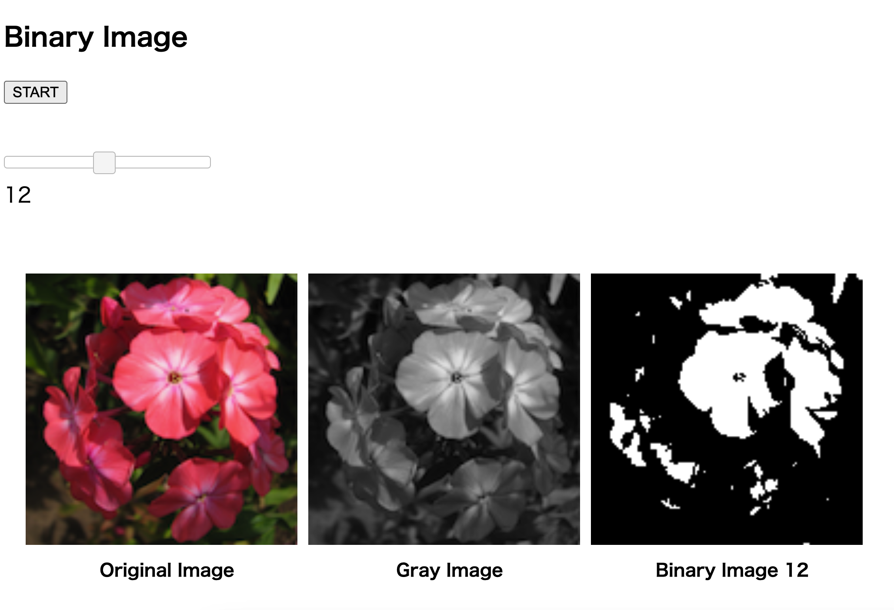

# tz_flask_20230315_binary

## outline
* Generate 25 kinds of binary images by pressing the start button (app.py work)
* Display a binary image of the value selected with the slider (app.py not work)

## view

